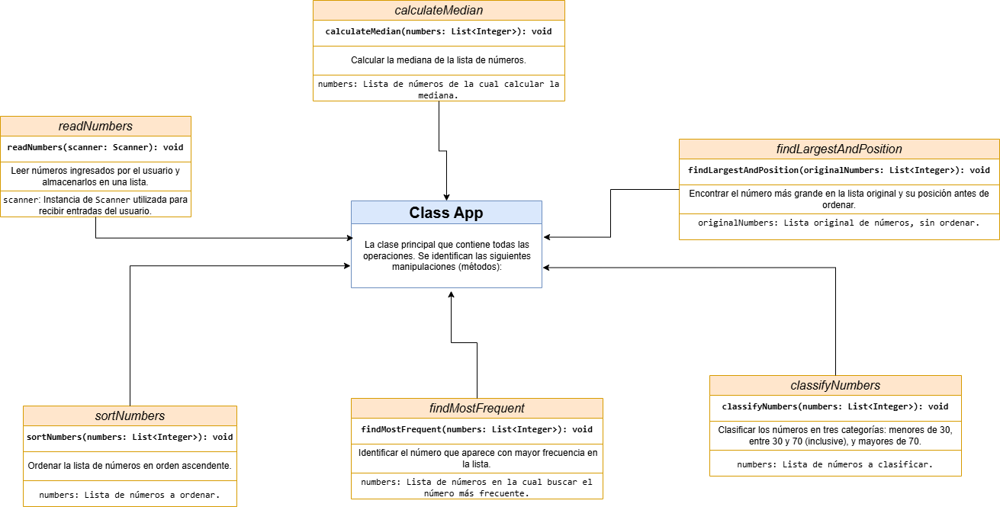

# Java Application: List Management and Analysis

## Description

This Java application allows the user to input a list of up to 1000 positive integers, with a minimum of 100 integers required. The input terminates when the sentinel value `0` is entered. The application performs several operations on the list, including:

1. Displaying the numbers in ascending order.
2. Calculating and printing the median (central value).
3. Determining the most frequently occurring number.
4. Printing three categorized lists:
   - Numbers less than 30.
   - Numbers greater than 70.
   - Numbers between 30 and 70 (inclusive).
5. Finding and printing the largest integer in the list along with its position in the original (unsorted) list.

## How the Application Works


## UML Diagram



1. **Input Data**: The application prompts the user to enter positive integers. The user can enter up to 1000 numbers, but must enter at least 100. Entering `0` ends the input process.
   
2. **Validation**: If fewer than 100 numbers are entered, the application stops and displays an error message.

3. **Sorting**: The list is sorted in ascending order and displayed.

4. **Calculating the Median**:
   - If the number of elements is even, the median is the average of the two middle numbers.
   - If the number of elements is odd, the median is the middle number.

5. **Finding the Most Frequent Number**: The application uses a `HashMap` to count the frequency of each number and identifies the most frequently occurring one.

6. **Classifying Numbers**:
   - Numbers are classified into three categories: less than 30, greater than 70, and between 30 and 70 (inclusive).

7. **Finding the Largest Number and Its Original Position**: The largest number in the original list (before sorting) is identified, and its original position is displayed.

## Example of Data Input and Output

### Example Input (100 Numbers)

```sh
Enter positive integers (maximum 1000, minimum 100). Enter 0 to finish:
15 90 30 45 75 10 5 80 100 50 
20 35 40 25 60 65 70 85 95 55 
1 3 2 4 6 7 8 9 11 12 
13 14 16 17 18 19 21 22 23 24 
26 27 28 29 31 32 33 34 36 37 
38 39 41 42 43 44 46 47 48 49 
51 52 53 54 56 57 58 59 61 62 
63 64 66 67 68 69 71 72 73 74 
76 77 78 79 81 82 83 84 86 87 
88 89 91 92 93 94 96 97 98 99 
0
```

### Example Output

- **Numbers in ascending order:**

  ```sh
  [1, 2, 3, 4, 5, 6, 7, 8, 9, 10, 11, 12, 13, 14, 15, 16, 17, 18, 19, 20, 21, 22, 23, 24, 25, 26, 27, 28, 29, 30, 31, 32, 33, 34, 35, 36, 37, 38, 39, 40, 41, 42, 43, 44, 45, 46, 47, 48, 49, 50, 51, 52, 53, 54, 55, 56, 57, 58, 59, 60, 61, 62, 63, 64, 65, 66, 67, 68, 69, 70, 71, 72, 73, 74, 75, 76, 77, 78, 79, 80, 81, 82, 83, 84, 85, 86, 87, 88, 89, 90, 91, 92, 93, 94, 95, 96, 97, 98, 99, 100]
  ```

- **Median:**

  ```sh
  50.5
  ```

- **Most frequent number:**

  ```sh
  1
  ```

- **Numbers less than 30:**

  ```sh
  [1, 2, 3, 4, 5, 6, 7, 8, 9, 10, 11, 12, 13, 14, 15, 16, 17, 18, 19, 20, 21, 22, 23, 24, 25, 26, 27, 28, 29]
  ```

- **Numbers greater than 70:**

  ```sh
  [71, 72, 73, 74, 75, 76, 77, 78, 79, 80, 81, 82, 83, 84, 85, 86, 87, 88, 89, 90, 91, 92, 93, 94, 95, 96, 97, 98, 99, 100]
  ```

- **Numbers between 30 and 70:**

  ```sh
  [30, 31, 32, 33, 34, 35, 36, 37, 38, 39, 40, 41, 42, 43, 44, 45, 46, 47, 48, 49, 50, 51, 52, 53, 54, 55, 56, 57, 58, 59, 60, 61, 62, 63, 64, 65, 66, 67, 68, 69, 70]
  ```

- **The largest number and its position before sorting:**

  ```sh
  The largest number is: 100 and its position before sorting is: 9
  ```

### Step-by-Step Explanation of the Example

1. **Input**: The user enters 100 positive integers, ending with `0` to indicate the end of input.
2. **Sorting**: The application sorts the numbers in ascending order.
3. **Calculating the Median**: 
   - Since there are 100 numbers (an even count), the median is the average of the 50th and 51st numbers (`50` and `51`): `(50 + 51) / 2 = 50.5`.
4. **Finding the Most Frequent Number**: All numbers are unique; the first number (`1`) is returned as the most frequent by default.
5. **Classifying Numbers**:
   - **Numbers less than 30**: All numbers from `1` to `29`.
   - **Numbers greater than 70**: All numbers from `71` to `100`.
   - **Numbers between 30 and 70**: All numbers from `30` to `70`.
6. **Finding the Largest Number and Its Original Position**: The largest number is `100`, and its position in the original list is `9`.

## Running the Tests

### JUnit Test Cases

This project includes a set of JUnit tests (`AppTest.java`) to validate the functionality of the main application. The tests cover the following scenarios:

1. **Test Case for Minimum Input (100 Numbers):**
   - Ensures that the application handles the minimum required input correctly, calculates the median, identifies the most frequent number, and classifies the numbers appropriately.

2. **Test Case for Intermediate Input (500 Numbers):**
   - Tests the application with an intermediate amount of data (500 numbers) to ensure correct sorting, median calculation, frequency determination, and classification.

3. **Test Case for Maximum Input (1000 Numbers):**
   - Verifies that the application can handle the maximum input size and perform all required operations efficiently.

### Running the Tests from Command Line

1. **Download the Required JAR Files:**

   - Download **JUnit 4.13.2**: [Download Link](https://repo1.maven.org/maven2/junit/junit/4.13.2/junit-4.13.2.jar)
   - Download **Hamcrest Core 1.3**: [Download Link](https://repo1.maven.org/maven2/org/hamcrest/hamcrest-core/1.3/hamcrest-core-1.3.jar)

   Save these files in the `lib` directory of your project.

2. **Compile the Application and Test Files:**

   ```sh
   javac -cp ".;lib\junit-4.13.2.jar;lib\hamcrest-core-1.3.jar" -d bin .\src\App.java .\test\AppTest.java
   ```

3. **Run the Tests with JUnit:**

   ```sh
    java -cp ".;bin;lib\junit-4.13.2.jar;lib\hamcrest-core-1.3.jar" org.junit.runner.JUnitCore AppTest
   ```

### Interpreting the Test Results

- If all tests pass, you will see output like:

  ```sh
  JUnit version 4.13.2
  ...
  Time: 0.035

  OK (3 tests)
  ```

- If a test fails, the output will provide details about which test failed and why, including any assertion messages defined in the test cases.

## Requirements

- Java JDK 8 or higher.
- Any text editor or IDE to edit the source code (such as VS Code, IntelliJ IDEA, Eclipse, etc.).
- JUnit 4.13.2 and Hamcrest Core 1.3 libraries for running the tests.

## Author

- **Name:** Juan David Pérez Numa  
- **Email:** [juperez49@unisalle.edu.co](mailto:juperez49@unisalle.edu.co)  
- **Student Code:** 4v241102  
